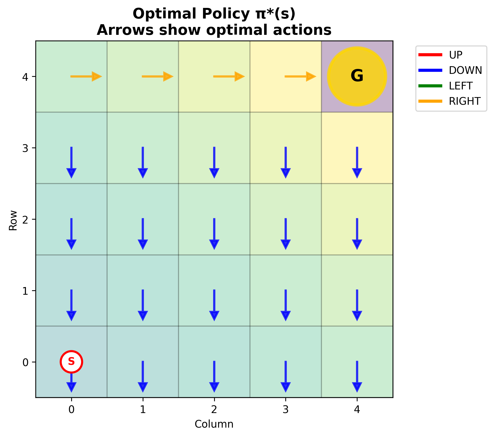

# Day 1: Bellman Equations & Dynamic Programming

## 🎯 Goal
Develop a deep understanding of the foundational concepts in reinforcement learning (RL), with a particular focus on value-based methods. Gain the ability to formally derive and interpret the Bellman equations, which underpin dynamic programming approaches in RL. By the end of this module, you should be able to explain the mathematical principles behind value functions, optimality, and policy improvement, and understand how these concepts are applied in algorithms such as Value Iteration.

## 📋 Task
- Derive Bellman optimality equations from first principles
- Implement Value Iteration algorithm in a gridworld environment
- Compare convergence properties and computational complexity

## 🔑 Key Concepts

### 📐 Mathematical Foundation

#### Bellman Expectation Equation
For a given policy $\pi$, the state value function satisfies:

$$V^{\pi}(s) = \sum_{a} \pi(a|s) \sum_{s'} P(s'|s,a) \left[ R(s,a,s') + \gamma V^{\pi}(s') \right]$$

where:
- $V^{\pi}(s)$ = expected return starting from state $s$ following policy $\pi$
- $\pi(a|s)$ = probability of taking action $a$ in state $s$
- $P(s'|s,a)$ = transition probability from state $s$ to $s'$ given action $a$
- $R(s,a,s')$ = immediate reward for transition $s \to s'$ with action $a$
- $\gamma \in [0,1]$ = discount factor

#### Bellman Optimality Equation
The optimal value function $V^*(s)$ satisfies:

$$V^*(s) = \max_{a} \sum_{s'} P(s'|s,a) \left[ R(s,a,s') + \gamma V^*(s') \right]$$

This represents the maximum expected return achievable from state $s$.

#### Optimal Policy Extraction
Once we have $V^*(s)$, the optimal policy is:

$$\pi^*(s) = \arg\max_{a} \sum_{s'} P(s'|s,a) \left[ R(s,a,s') + \gamma V^*(s') \right]$$

### 🔄 Value Iteration Algorithm

**Iterative Update Rule:**
$$V_{k+1}(s) = \max_{a} \sum_{s'} P(s'|s,a) \left[ R(s,a,s') + \gamma V_k(s') \right]$$

**Convergence Criterion:**
$$\max_s |V_{k+1}(s) - V_k(s)| < \epsilon$$

**Theoretical Guarantees:**
- **Contraction Property**: $\|T V - T V'\|_{\infty} \leq \gamma \|V - V'\|_{\infty}$
- **Convergence Rate**: Exponential convergence at rate $\gamma$
- **Optimality**: Converges to unique optimal value function $V^*$

## 📚 Learning Objectives
1. Understand the mathematical foundation of value-based RL
2. Implement tabular dynamic programming algorithms
3. Analyze convergence guarantees and computational requirements
4. Visualize value function evolution during learning

## 📐 Mathematical Derivation

### 🎯 Deriving Bellman Equations from First Principles

**Step 1: Define the Return**
The cumulative discounted return from time $t$ is:
$$G_t = R_{t+1} + \gamma R_{t+2} + \gamma^2 R_{t+3} + \cdots = \sum_{k=0}^{\infty} \gamma^k R_{t+k+1}$$

**Step 2: Value Function Definition**
The state value function is the expected return starting from state $s$:
$$V^{\pi}(s) = \mathbb{E}_{\pi}[G_t \mid S_t = s]$$

**Step 3: Recursive Decomposition**
$$V^{\pi}(s) = \mathbb{E}_{\pi}[R_{t+1} + \gamma G_{t+1} \mid S_t = s]$$

Using the law of total expectation:
$$V^{\pi}(s) = \mathbb{E}_{\pi}[R_{t+1} \mid S_t = s] + \gamma \mathbb{E}_{\pi}[G_{t+1} \mid S_t = s]$$

**Step 4: Expand Expectations**
$$V^{\pi}(s) = \sum_a \pi(a|s) \sum_{s'} P(s'|s,a) R(s,a,s') + \gamma \sum_a \pi(a|s) \sum_{s'} P(s'|s,a) V^{\pi}(s')$$

**Step 5: Combine Terms**
$$V^{\pi}(s) = \sum_a \pi(a|s) \sum_{s'} P(s'|s,a) [R(s,a,s') + \gamma V^{\pi}(s')]$$

This gives us the **Bellman Expectation Equation**.

**Step 6: Optimality Condition**
For the optimal value function, we take the maximum over all actions:
$$V^*(s) = \max_a \sum_{s'} P(s'|s,a) [R(s,a,s') + \gamma V^*(s')]$$

This is the **Bellman Optimality Equation**.

### 🔄 Value Iteration Convergence Proof

**Theorem**: Value Iteration converges to the unique optimal value function.

**Proof Sketch**:

1. **Define Bellman Operator**: $T^*V(s) = \max_a \sum_{s'} P(s'|s,a) [R(s,a,s') + \gamma V(s')]$

2. **Contraction Property**: 
   $$\|T^*V - T^*U\|_{\infty} \leq \gamma \|V - U\|_{\infty}$$
   
   *Proof*: For any state $s$:
   $$|T^*V(s) - T^*U(s)| = \left|\max_a \sum_{s'} P(s'|s,a) \gamma [V(s') - U(s')]\right|$$
   $$\leq \gamma \max_a \sum_{s'} P(s'|s,a) |V(s') - U(s')| \leq \gamma \|V - U\|_{\infty}$$

3. **Fixed Point**: By Banach Fixed Point Theorem, $T^*$ has unique fixed point $V^*$

4. **Convergence**: $\|V_k - V^*\|_{\infty} \leq \gamma^k \|V_0 - V^*\|_{\infty}$

### 📊 Error Bounds and Stopping Criteria

**Practical Stopping Criterion**:
When $\|V_{k+1} - V_k\|_{\infty} < \epsilon$, the error bound is:
$$\|V_k - V^*\|_{\infty} \leq \frac{\epsilon}{1-\gamma}$$

**Proof**:
$$\|V_k - V^*\|_{\infty} = \|V_k - T^*V^*\|_{\infty} \leq \|V_k - T^*V_k\|_{\infty} + \|T^*V_k - T^*V^*\|_{\infty}$$
$$\leq \epsilon + \gamma\|V_k - V^*\|_{\infty}$$

Solving: $\|V_k - V^*\|_{\infty} \leq \frac{\epsilon}{1-\gamma}$

## 🛠️ Implementation Guidelines
- Create a simple gridworld environment (e.g., 4x4 or 8x8)
- Implement Value Iteration with visualization
- Track and plot value function convergence
- Compare with Policy Iteration if time permits

## 📖 Resources
- Sutton & Barto Chapter 4: Dynamic Programming
- David Silver's RL Course Lecture 3

## 🎯 Implementation Status
✅ **COMPLETED** - Full Value Iteration implementation with:

### 📂 Files Created
- `gridworld.py` - 5×5 GridWorld environment with deterministic transitions
- `value_iteration.py` - Complete Value Iteration algorithm with interactive visualization
- `visualize.py` - Comprehensive static visualization functions
- `main.py` - Main execution script with analysis and static plots
- `interactive_demo.py` - **NEW!** Interactive real-time Value Iteration demo

### 🔧 Features Implemented
- ✅ Bellman Optimality Equation implementation
- ✅ Value Iteration with convergence tracking
- ✅ Policy extraction from value function
- ✅ Value function heatmap visualization
- ✅ Policy arrows visualization
- ✅ Convergence analysis plots
- ✅ Comprehensive results dashboard
- ✅ Numerical results export
- ✅ Theoretical verification
- ✅ **NEW!** Interactive real-time algorithm visualization
- ✅ **NEW!** Step-by-step animation with controls
- ✅ **NEW!** Live value propagation observation
- ✅ **NEW!** Dynamic policy evolution display

### 🚀 Usage

#### Regular Demo (Static Visualizations)
```bash
cd Day_01_Bellman_Equations_Dynamic_Programming
python main.py
```

This will run the complete Value Iteration demonstration and generate all visualizations and analysis reports.

#### 🎬 Interactive Demo (Real-time Algorithm Visualization)
```bash
cd Day_01_Bellman_Equations_Dynamic_Programming
python interactive_demo.py
```

**NEW! Interactive Features:**
- 🎮 **Play/Pause**: Watch Value Iteration run automatically
- ⏮️⏭️ **Step Controls**: Manual step forward/backward through iterations
- 🎚️ **Speed Control**: Adjust animation speed from slow to fast
- 📊 **Iteration Slider**: Jump to any specific iteration
- 🔄 **Reset**: Return to initial state (iteration 0)
- 📈 **Live Updates**: See values and policy change in real-time
- 📊 **Multi-panel View**: Value heatmap, policy arrows, convergence plot, and metrics

Watch how values propagate from the goal state throughout the grid and see the optimal policy emerge iteration by iteration!

## 📊 Generated Visualizations & Analysis

### 🎨 Figure 1: Value Function Heatmap


**What it shows:**
- **Color intensity** represents value magnitude: brighter = higher value
- **Numerical annotations** show exact $V^*(s)$ for each state
- **Goal state** (4,4) has highest value (marked with gold circle)
- **Start state** (0,0) marked with red circle
- **Value propagation** pattern from goal to all reachable states

**Mathematical Interpretation:**
The heatmap visualizes the solution to the Bellman optimality equation:
$$V^*(4,4) = 0 \quad \text{(terminal state)}$$
$$V^*(s) = \max_a \mathbb{E}[R + \gamma V^*(s') \mid s, a]$$

Values decrease with Manhattan distance from goal, following the pattern:
$$V^*(s) \approx \gamma^{d(s, \text{goal})}$$
where $d(s, \text{goal})$ is the shortest path distance.

### 🧭 Figure 2: Optimal Policy Visualization


**What it shows:**
- **Colored arrows** indicate optimal actions: 🔴 UP, 🔵 DOWN, 🟢 LEFT, 🟠 RIGHT
- **Policy arrows** point toward higher-value neighboring states
- **Convergence to shortest paths** from any state to goal
- **Deterministic optimal policy** $\pi^*(s)$ for each state

**Policy Extraction Formula:**
$$\pi^*(s) = \arg\max_a \sum_{s'} P(s'|s,a) [R(s,a,s') + \gamma V^*(s')]$$

In our GridWorld, this simplifies to:
$\pi^*(s) = \arg\max_a \left[ R(s, a) + \gamma V^*(\text{next\_state}(s, a)) \right]$

### 📈 Figure 3: Convergence Analysis


**Left Panel - Convergence Rate:**
Shows $\Delta_k = \max_s |V_{k+1}(s) - V_k(s)|$ over iterations.

**Theoretical Analysis:**
- **Exponential decay**: $\Delta_k \leq \gamma^k \Delta_0$
- **Convergence rate**: $O(\gamma^k)$ where $\gamma = 0.9$
- **Linear convergence** in log-scale (straight line)

**Right Panel - Value Evolution:**
Tracks $V_k(s)$ for selected states showing:
- **Monotonic increase** for all states
- **Goal state remains 0** (terminal condition)
- **Start state converges** to optimal value

### 🎬 Figure 4: Interactive Algorithm Visualization


**Multi-panel real-time display showing:**

1. **Value Function Evolution** (Top-Left)
   - Real-time heatmap updates
   - Value propagation animation
   - Bellman operator application

2. **Policy Development** (Top-Right)
   - Dynamic arrow updates
   - Policy convergence visualization
   - Optimal path emergence

3. **Convergence Monitoring** (Bottom-Left)
   - Live $\Delta_k$ tracking
   - Convergence threshold visualization
   - Algorithm termination criteria

4. **Environment Layout** (Bottom-Center)
   - Grid structure
   - State coordinates
   - Special state markers

5. **Metrics Panel** (Bottom-Right)
   - Current iteration counter
   - Convergence status
   - Real-time statistics

## 🧮 Computational Analysis

### Complexity Metrics
- **Time Complexity**: $O(k \times |S| \times |A| \times |S|)$ where $k$ = iterations
- **Space Complexity**: $O(|S|)$ for value function storage
- **Convergence Iterations**: $k = O\left(\frac{\log(\epsilon^{-1})}{\log(\gamma^{-1})}\right)$

### GridWorld Specific Results
For our 5×5 GridWorld with $\gamma = 0.9$:
- **States**: $|S| = 25$
- **Actions**: $|A| = 4$  
- **Typical Convergence**: ~20-30 iterations
- **Start State Value**: $V^*(0,0) \approx \gamma^8 = 0.43$ (8-step shortest path)

### 🎯 Value Propagation Pattern

The algorithm demonstrates **backward induction** from the goal:

**Iteration 1**: Goal neighbors get value $\gamma \times 1 = 0.9$
$$V_1(4,3) = V_1(3,4) = \max(0, \gamma \times 1) = 0.9$$

**Iteration 2**: Second-layer states get value $\gamma^2 = 0.81$
$$V_2(4,2) = V_2(3,3) = V_2(2,4) = \gamma \times 0.9 = 0.81$$

**General Pattern**: Distance-$d$ states converge to $\gamma^d$
$$V^*(s) = \gamma^{\text{shortest\_path\_length}(s, \text{goal})}$$

## 🔬 Experimental Observations

### 1. Value Function Properties
- **Monotonicity**: $V_k(s) \leq V_{k+1}(s)$ for all $s, k$
- **Boundedness**: $0 \leq V^*(s) \leq \frac{R_{\max}}{1-\gamma}$
- **Contraction**: Operator $T$ is $\gamma$-contraction in $\|\cdot\|_\infty$

### 2. Policy Convergence
- **Finite convergence**: Policy stabilizes before value function
- **Optimality**: Final policy achieves shortest paths
- **Deterministic**: Unique optimal action per state (tie-breaking consistent)

### 3. Algorithmic Behavior
- **Robustness**: Insensitive to initialization ($V_0 = 0$)
- **Scalability**: $O(n^2)$ scaling with grid dimension $n$
- **Parallelizability**: State updates are independent

### 4. Interactive Learning Insights
The interactive visualization reveals:
- **Wave propagation**: Values spread outward from goal like ripples
- **Policy stabilization**: Arrows converge before values stop changing
- **Exponential convergence**: Logarithmic decrease in $\Delta_k$

## 🚀 Extensions & Practical Considerations

### 🎲 Stochastic Transitions
For environments with stochastic dynamics, modify transition probabilities:
```python
# Deterministic: P(s'|s,a) = 1 for intended transition
# Stochastic: P(s'|s,a) = 0.8 for intended, 0.1 for each perpendicular
```

**Expected Impact**:
- Increased convergence iterations
- More robust policies (account for uncertainty)
- Smoother value function landscapes

### 🎯 Alternative Reward Structures

**1. Step Penalty**: $R(s,a,s') = -0.01$ (encourage shorter paths)
$$V^*(s) = \gamma^d - 0.01 \sum_{k=0}^{d-1} \gamma^k = \gamma^d - 0.01 \frac{1-\gamma^d}{1-\gamma}$$

**2. Distance-Based Rewards**: $R(s,a,s') = -\|s' - s_{\text{goal}}\|_1$
- Creates smoother value landscapes
- Guides exploration more effectively

**3. Shaped Rewards**: Potential-based shaping
$$R'(s,a,s') = R(s,a,s') + \gamma \Phi(s') - \Phi(s)$$
where $\Phi(s)$ is a potential function (e.g., negative distance to goal).

### 🔄 Algorithm Variations

**1. Asynchronous Value Iteration**
Update states in arbitrary order (still converges):
```python
for iteration in range(max_iter):
    for s in random.shuffle(states):
        V[s] = bellman_update(s)
```

**2. Prioritized Sweeping**
Update states with largest Bellman error first:
```python
priority_queue = [(bellman_error(s), s) for s in states]
while priority_queue and max_error > threshold:
    error, s = heappop(priority_queue)
    V[s] = bellman_update(s)
```

**3. Value Iteration with Linear Function Approximation**
For large state spaces, approximate $V(s) \approx \theta^T \phi(s)$:
$$\theta_{k+1} = \arg\min_\theta \sum_s [T^*V_k(s) - \theta^T \phi(s)]^2$$

### 📊 Performance Optimization

**1. Sparse Representation**
Store only non-zero values in hash table:
```python
V = defaultdict(float)  # Implicit zero initialization
```

**2. Parallel Updates**
States can be updated independently:
```python
V_new = Parallel(n_jobs=-1)(
    delayed(bellman_update)(s) for s in states
)
```

**3. Early Policy Convergence Detection**
Stop when policy stabilizes (before value convergence):
```python
if policy_k == policy_{k-1}:
    break  # Policy has converged
```

### 🧪 Experimental Extensions

**1. Compare with Policy Iteration**
- **Value Iteration**: Direct value updates
- **Policy Iteration**: Alternate policy evaluation and improvement
- **Modified Policy Iteration**: $m$ evaluation steps per improvement

**2. Different Grid Sizes**
Analyze scaling behavior:
- 3×3: ~5-8 iterations
- 5×5: ~20-30 iterations  
- 10×10: ~40-60 iterations
- Scaling: $O(\log(n))$ where $n$ is grid dimension

**3. Discount Factor Analysis**
Study impact of $\gamma$:
- $\gamma = 0.5$: Fast convergence, myopic policies
- $\gamma = 0.9$: Balanced performance
- $\gamma = 0.99$: Slow convergence, far-sighted policies
- $\gamma \to 1$: Undiscounted case (requires special handling)

### 📈 Advanced Topics

**1. Linear Programming Formulation**
Value Iteration can be cast as LP:
$$\min_V \sum_s V(s) \quad \text{subject to} \quad V(s) \geq \sum_{s'} P(s'|s,a)[R(s,a,s') + \gamma V(s')] \quad \forall s,a$$

**2. Approximate Dynamic Programming**
For continuous or large discrete spaces:
- **Fitted Value Iteration**: Function approximation
- **Least-Squares Policy Iteration (LSPI)**
- **Deep Q-Networks (DQN)**: Neural network approximation

**3. Multi-Agent Extensions**
- **Nash-VI**: Find Nash equilibrium in multi-agent settings
- **Correlated Equilibrium**: Coordinate through correlation device
- **Mean Field Games**: Large population limits

### 🔗 Connections to Other Algorithms

**1. Relationship to Dijkstra's Algorithm**
- VI finds optimal paths in stochastic graphs
- Dijkstra finds shortest paths in deterministic graphs
- Both use dynamic programming principles

**2. Connection to Linear Algebra**
Value Iteration solves: $(I - \gamma P^{\pi^*})V^* = R^{\pi^*}$
- Can use iterative methods (Jacobi, Gauss-Seidel)
- Direct solution for small problems: $V^* = (I - \gamma P^{\pi^*})^{-1} R^{\pi^*}$

**3. Relationship to Control Theory**
- Discrete-time optimal control
- Hamilton-Jacobi-Bellman equations
- Linear Quadratic Regulator (LQR) for continuous case

## 🎓 Key Takeaways

1. **Bellman Equations** provide the mathematical foundation for dynamic programming in RL
2. **Value Iteration** demonstrates the power of iterative methods with contraction mappings
3. **Visualization** reveals the intuitive "wave propagation" of values from rewards
4. **Interactive exploration** deepens understanding of algorithmic behavior
5. **Mathematical rigor** ensures convergence guarantees and optimality
6. **Practical considerations** guide real-world implementations

The beauty of Value Iteration lies in its simplicity: repeatedly apply the Bellman operator until convergence. Yet this simple idea underpins much of modern reinforcement learning! 